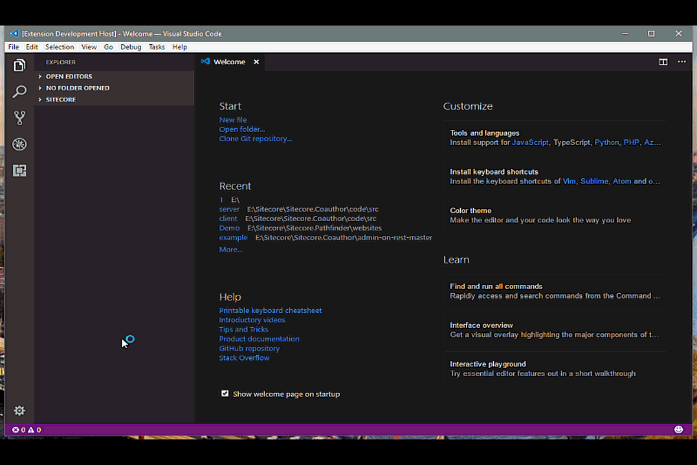

# Sitecore Rocks Visual Studio Code

Sitecore Rocks VS Code is an extension for Visual Studio Code, that allows developers to connect to Sitecore
websites and edit items.

## Features

* Connect to multiple Sitecore websites
* Open multiple databases at the same time
* Edit items
* Insert new items
* Delete items

## Requirements

The Sitecore.ContentDelivery Sitecore package must be installed in the Sitecore website.

